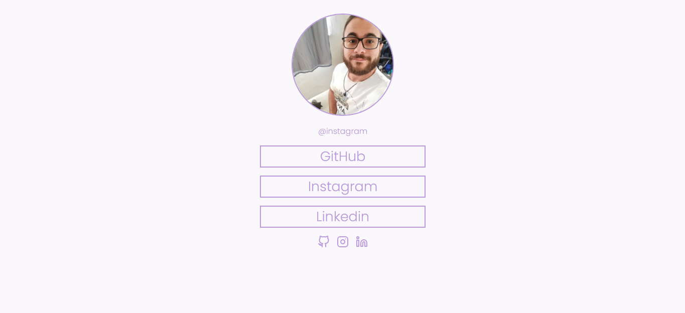

<h1 align="center"> Social Tree </h1>

O projeto é a resolução do desafio Social Tree disponível no curso Discover da Rocketseat.  

  <a href="#technologies">Technologies</a>&nbsp;&nbsp;&nbsp;|&nbsp;&nbsp;&nbsp;
  <a href="#project">Project</a>

 

  

## 🚀 Technologies

Esse projeto foi desenvolvido com as seguintes tecnologias:

- HTML e CSS
- Git e Github

## 💻 Project

O projeto consiste em uma página com uma lista de links (menu) que pode ser usada em perfis de redes sociais para direcionar o usuário para o local escolhido.

- [Visite o projeto online](https://socialtree-raulrodmo.netlify.app/)

---

Made with 💜 by raulrodmo

